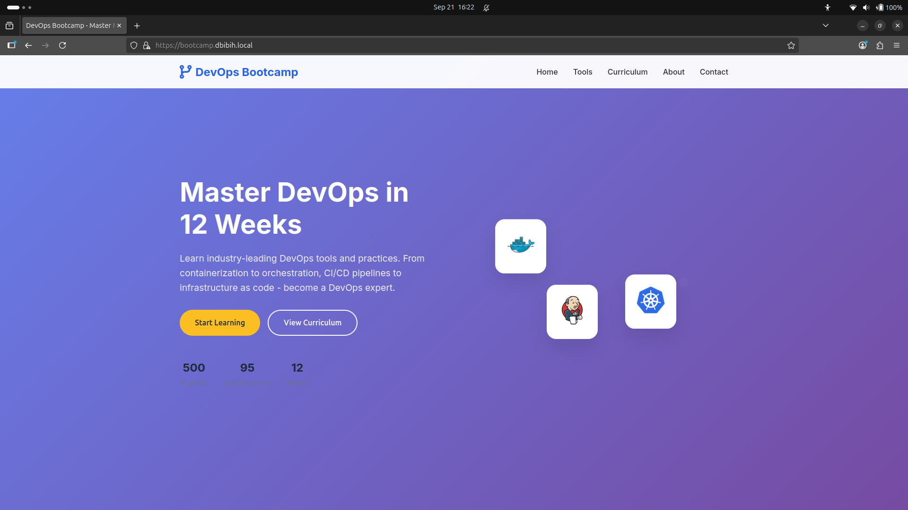

# Nginx Proxy for Node.js Applications

A production-ready setup for load balancing multiple Node.js applications using Nginx as a reverse proxy with SSL termination, health checks, and container orchestration.

## 📋 Overview



This project demonstrates how to set up a scalable Node.js application architecture using:
- **Multiple Node.js instances** for high availability
- **Nginx reverse proxy** for load balancing and SSL termination
- **Docker Compose** for container orchestration
- **SSL/TLS encryption** for secure communication
- **Health checks** for monitoring application status
- **Custom domain** support for local development

The setup includes a modern DevOps Bootcamp landing page as an example application, showcasing various DevOps tools and technologies.

## 🛠️ Technologies

### Backend
- **Node.js** - JavaScript runtime
- **Express.js** - Web application framework
- **Docker** - Containerization platform
- **Docker Compose** - Multi-container orchestration

### Infrastructure
- **Nginx** - Reverse proxy and load balancer
- **SSL/TLS** - Encryption and security
- **Health Checks** - Application monitoring
- **Custom DNS** - Local domain resolution

### DevOps Tools Showcased
- Docker
- Kubernetes
- Jenkins
- Terraform
- ArgoCD
- Helm
- GitLab
- Grafana
- Harbor
- K3s
- Longhorn
- RKE2

## 🏗️ Architecture

```
┌─────────────────────────────────────────────────────────────┐
│                    Client Browser                           │
└─────────────────────┬───────────────────────────────────────┘
                      │ HTTPS/HTTP
┌─────────────────────▼───────────────────────────────────────┐
│                  Nginx Load Balancer                       │
│  ┌─────────────────┐  ┌─────────────────┐                 │
│  │   HTTP (80)     │  │   HTTPS (443)   │                 │
│  │   Redirect      │  │   SSL/TLS       │                 │
│  └─────────────────┘  └─────────────────┘                 │
└─────────────────────┬───────────────────────────────────────┘
                      │ Load Balancing
┌─────────────────────▼───────────────────────────────────────┐
│                Node.js Applications                        │
│  ┌─────────────┐  ┌─────────────┐  ┌─────────────┐        │
│  │   App-1     │  │   App-2     │  │   App-3     │        │
│  │  Port 3001  │  │  Port 3002  │  │  Port 3003  │        │
│  │ Instance 1  │  │ Instance 2  │  │ Instance 3  │        │
│  └─────────────┘  └─────────────┘  └─────────────┘        │
└─────────────────────────────────────────────────────────────┘
```

### Key Components

1. **Nginx Load Balancer**
   - SSL termination
   - HTTP to HTTPS redirect
   - Load balancing across Node.js instances
   - Health check endpoints

2. **Node.js Applications**
   - Three identical instances for high availability
   - Instance-specific logging
   - Health check endpoints
   - API endpoints for dynamic content

3. **SSL/TLS Security**
   - Self-signed certificates for development
   - Production-ready SSL configuration
   - Secure headers and protocols

## 🚀 How to Use

### Prerequisites

- Docker and Docker Compose installed
- OpenSSL (for certificate generation)
- Git (for cloning the repository)

### Quick Start

1. **Clone the repository**
   ```bash
   git clone <your-repository-url>
   cd nginx-nodejs-proxy
   ```

2. **Generate SSL certificates**
   ```bash
   # Create certificates directory
   mkdir -p docker/certs
   
   # Generate self-signed certificate
   openssl req -x509 -newkey rsa:4096 -keyout docker/certs/server.key -out docker/certs/server.crt -days 365 -nodes \
       -subj "/C=US/ST=CA/L=San Francisco/O=DevOps Bootcamp/CN=localhost" \
       -addext "subjectAltName=DNS:localhost,DNS:127.0.0.1,IP:127.0.0.1"
   ```

3. **Start the application**
   ```bash
   docker-compose up --build -d
   ```

4. **Access the application**
   - HTTP: `http://localhost` (redirects to HTTPS)
   - HTTPS: `https://localhost`
   - Direct app access: `http://localhost:3001`, `http://localhost:3002`, `http://localhost:3003`

### Custom Domain Setup

1. **Add custom domain to hosts file**
   ```bash
   echo "127.0.0.1    bootcam.dbibih.local" | sudo tee -a /etc/hosts
   ```

2. **Generate certificate for custom domain**
   ```bash
   openssl req -x509 -newkey rsa:4096 -keyout docker/certs/server.key -out docker/certs/server.crt -days 365 -nodes \
       -subj "/C=US/ST=CA/L=San Francisco/O=DevOps Bootcamp/CN=bootcam.dbibih.local" \
       -addext "subjectAltName=DNS:bootcam.dbibih.local,DNS:localhost,DNS:127.0.0.1,IP:127.0.0.1"
   ```

3. **Update nginx.conf server_name**
   ```nginx
   server_name bootcam.dbibih.local localhost;
   ```

4. **Restart containers**
   ```bash
   docker-compose down
   docker-compose up --build -d
   ```

5. **Access via custom domain**
   - `https://bootcam.dbibih.local`

### SSL Configuration

#### Development (Self-Signed Certificates)
```bash
# Generate development certificate
openssl req -x509 -newkey rsa:4096 -keyout docker/certs/server.key -out docker/certs/server.crt -days 365 -nodes \
    -subj "/C=US/ST=CA/L=San Francisco/O=DevOps Bootcamp/CN=localhost" \
    -addext "subjectAltName=DNS:localhost,DNS:127.0.0.1,IP:127.0.0.1"
```

#### Production (Let's Encrypt)
```bash
# Install certbot
sudo apt update
sudo apt install certbot

# Generate production certificate
sudo certbot certonly --standalone -d yourdomain.com

# Update nginx.conf to use Let's Encrypt certificates
ssl_certificate /etc/letsencrypt/live/yourdomain.com/fullchain.pem;
ssl_certificate_key /etc/letsencrypt/live/yourdomain.com/privkey.pem;
```

### Docker Compose Commands

```bash
# Start all services
docker-compose up -d

# Start with build
docker-compose up --build -d

# View logs
docker-compose logs -f

# Stop all services
docker-compose down

# Stop and remove volumes
docker-compose down -v

# Scale Node.js applications
docker-compose up --scale app-1=2 --scale app-2=2 --scale app-3=2 -d
```

### Node.js Development

```bash
# Navigate to app directory
cd app

# Install dependencies
npm install

# Start development server
npm run dev

# Start production server
npm start

# Run with custom instance ID
INSTANCE_ID=dev npm start
```

### Monitoring and Health Checks

```bash
# Check application health
curl https://localhost/health

# Check individual app health
curl http://localhost:3001/health
curl http://localhost:3002/health
curl http://localhost:3003/health

# View container logs
docker logs app-1
docker logs app-2
docker logs app-3
docker logs nginx-lb

# Check container status
docker-compose ps
```

### API Endpoints

- `GET /` - Main application page
- `GET /health` - Health check endpoint
- `POST /api/contact` - Contact form submission
- `GET /api/stats` - Application statistics
- `GET /api/curriculum` - Curriculum information
- `GET /api/tools` - DevOps tools information

### Troubleshooting

#### Common Issues

1. **Port conflicts**
   ```bash
   # Check if ports are in use
   netstat -tulpn | grep :80
   netstat -tulpn | grep :443
   ```

2. **SSL certificate issues**
   ```bash
   # Verify certificate
   openssl x509 -in docker/certs/server.crt -text -noout
   
   # Check certificate validity
   openssl verify docker/certs/server.crt
   ```

3. **Container not starting**
   ```bash
   # Check container logs
   docker logs <container-name>
   
   # Check container status
   docker ps -a
   ```

4. **DNS resolution issues**
   ```bash
   # Test DNS resolution
   nslookup localhost
   ping localhost
   ```

### File Structure

```
nginx-nodejs-proxy/
├── app/                          # Node.js application
│   ├── imgs/                     # Application images
│   ├── index.html               # Main HTML page
│   ├── index.css                # Styles
│   ├── index.js                 # Client-side JavaScript
│   ├── server.js                # Express server
│   ├── package.json             # Node.js dependencies
│   ├── Dockerfile               # Production Docker image
│   └── Dockerfile.dev           # Development Docker image
├── docker/                       # Docker configuration
│   ├── nginx.conf               # Nginx configuration
│   └── certs/                   # SSL certificates
├── compose.yml                   # Docker Compose configuration
├── .gitignore                   # Git ignore rules
└── README.md                    # This file
```

### Security Considerations

- SSL/TLS encryption for all communications
- Secure headers in Nginx configuration
- Non-root user in Docker containers
- Health checks for monitoring
- Proper error handling and logging

### Performance Optimization

- Nginx load balancing with least connections
- Gzip compression enabled
- Static file caching
- Connection pooling
- Health check monitoring

## 📝 License

This project is licensed under the MIT License - see the LICENSE file for details.

## 🤝 Contributing

1. Fork the repository
2. Create a feature branch
3. Commit your changes
4. Push to the branch
5. Create a Pull Request

## 📞 Support

For support and questions, please open an issue in the repository or contact the maintainers.

---

**Happy coding! 🚀**
